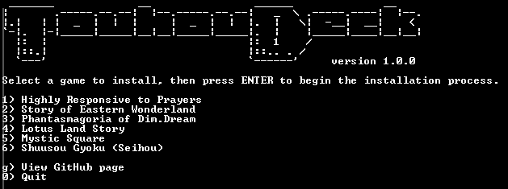

# TouhouDeck
TouhouDeck is a script that provides a convenient way to set up and play the classic Touhou/Seihou games on the Steam Deck, or other Linux-based handheld PCs and devices.

# Contents  
- [Supported Titles](#supported-titles) 
- [Installation](#installation)
  - [PC-98 Titles (Touhou 1-5)](#pc-98-titles-touhou-1-5)
  - [Seihou Shuusou Gyoku](#seihou-shuusou-gyoku)

# Supported Titles
Version 1.0.0 of TouhouDeck will have compatibility with the following games:
| Game                          | Compatibility  |
| ----------------------------- | -------------- |
|  Highly Responsive to Prayers  | ✅ Compatible     |
|  Story of Eastern Wonderland   | ✅ Compatible     |
|  Phantasmagoria of Dim.Dream   | ✅ Compatible     |
|  Lotus Land Story              | ✅ Compatible     |
|  Mystic Square                 | ✅ Compatible     |
|  Shuusou Gyoku (Seihou)        | ✅ Compatible thanks to [the ReC98 port of SSG for Linux (thanks guys!)](https://flathub.org/en/apps/net.nmlgc.rec98.sh01)   |
|  Kioh Gyoku (Seihou)           | ❌ Incompatible   |
| 🌻 Torte Le Magic                | ⏳ Planned for update v1.2.0 but possibly incompatible |
|  Embodiment of Scarlet Devil   | ⏳ Planned for update v1.1.0     |
|  Perfect Cherry Blossom        | ⏳ Planned for update v1.1.0     |
|  Immaterial and Missing Power  | ⏳ Planned for update v1.2.0     |
|  Imperishable Night            | ⏳ Planned for update v1.1.0     |
|  Banshiryuu (Seihou)           | ❓ Unknown Status |
|  Uwabami Breakers (alcostg)    | ❓ Unknown Status |
| Any mainline games from PoFV onward | ❌ Will never be compatible, they can be bought on Steam |

# Installation
First of all, you are going to want to download the script from the Releases tab. Then, open up your terminal of choice and navigate to the script's location. After that, start the script using your terminal. The script should check to see if Git is installed, before bringing you to this screen:

## PC-98 Titles (Touhou 1-5)
The PC-98 Touhou games may seem rather difficult to install, but it's actually really easy! You can install any game from the entire Touhou PC-98 pentaology, but they <b>won't have the sound BIOS set up as the process isn't as simple as it would be on Windows devices</b>. I'll see if I can get them added for a future update, but you're going to have to wait if you want the games to sound like they would on native hardware. If you don't care about that, then by all means keep going with the tutorial!

Select the game you want to install (this guide will use Story of Eastern Wonderland as an example) and press ENTER on your (virtual) keyboard. The script will install DOSBox-X if it hasn't been already and download the necessary files. Once that part of the installation is complete, the script will tell you the following:
<i>"File downlolading is done. Now, drag and drop then files found in the th05 directory into the dosbox-x parent folder. The Steam shortcut will not work otherwise. Press ENTER to begin the next step."</i>

Basically, you need to drag and drop the included .conf and .hdi files into the dosbox-x folder that the th0x folder is located in. Enter Selection Mode on your device, and drag and drop it onto the dosbox-x folder as seen on the navigation bar. (NOT com.dosbox_x.DOSBox-X!!!)
