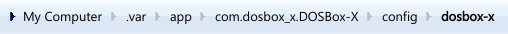
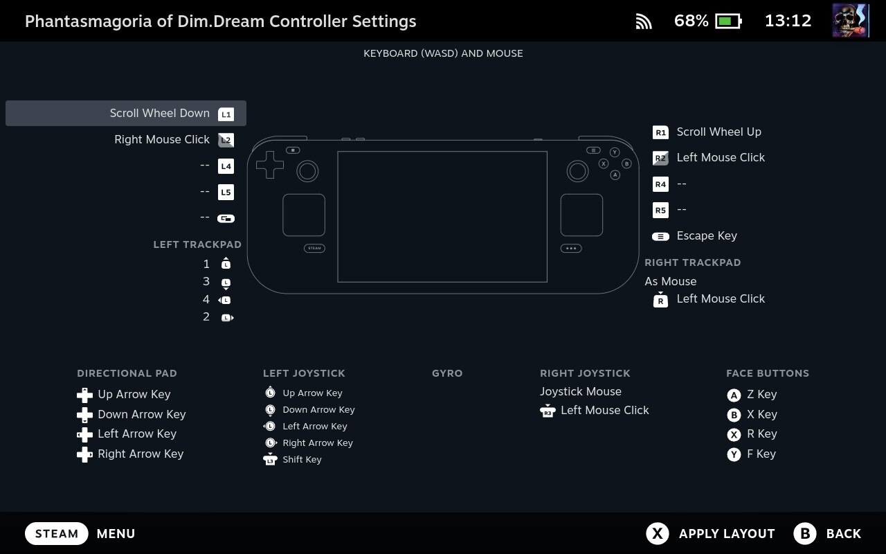

# TouhouDeck
TouhouDeck is a script that provides a convenient way to set up and play the classic Touhou/Seihou games on the Steam Deck, or other SteamOS-based handheld PCs and devices.

# Contents  
- [Supported Titles](#supported-titles) 
- [Installation](#installation)
  - [The PC-98 Games (Touhou 1-5)](#the-pc-98-games-touhou-1-5)
  - [Seihou Shuusou Gyoku](#seihou-shuusou-gyoku)

# Supported Titles
TouhouDeck currently has compatibility with the following games:
| Game                          | Compatibility  |
| ----------------------------- | -------------- |
|  Highly Responsive to Prayers  | ✅ Compatible     |
|  Story of Eastern Wonderland   | ✅ Compatible     |
|  Phantasmagoria of Dim.Dream   | ✅ Compatible     |
|  Lotus Land Story              | ✅ Compatible     |
|  Mystic Square                 | ✅ Compatible     |
|  Shuusou Gyoku (Seihou)        | ✅ Compatible thanks to [the ReC98 port of SSG for Linux (thanks guys!)](https://flathub.org/en/apps/net.nmlgc.rec98.sh01)   |
|  Kioh Gyoku (Seihou)           | ❌ Incompatible   |
| 🌻 Torte Le Magic                | ⏳ Planned for update v1.2.0 but possibly incompatible |
|  Embodiment of Scarlet Devil   | ⏳ Planned for update v1.1.0     |
|  Perfect Cherry Blossom        | ⏳ Planned for update v1.1.0     |
|  Immaterial and Missing Power  | ⏳ Planned for update v1.2.0     |
|  Imperishable Night            | ⏳ Planned for update v1.1.0     |
|  Banshiryuu (Seihou)           | ❓ Unknown Status |
|  Uwabami Breakers (alcostg)    | ❓ Unknown Status |
| Any mainline games from PoFV onward | ❌ Will never be compatible, they can be bought on Steam |

# Installation
First of all, you are going to want to download the script from the Releases tab. Then, open up your terminal of choice and navigate to the script's location. After that, start the script using your terminal. The script should check to see if Git is installed, before bringing you to this screen:

## The PC-98 Games (Touhou 1-5)
The PC-98 Touhou games may seem rather difficult to install, but it's actually a lot easier in practice! You can install any game from the entire Touhou PC-98 pentaology, but they <b>won't have the sound BIOS set up as the process isn't as simple as it would be on Windows devices</b>. I'll see if I can get them added in a future update, but you're going to have to wait if you want the games to sound like they would on native hardware. If you don't care about that, then by all means keep going with the tutorial!

Select the game you want to install and press ENTER on your (virtual) keyboard. The script will install DOSBox-X if it hasn't been already and download the necessary files. Once that part of the installation is complete, the script will tell you the following:

<i>"File downlolading is done. Now, drag and drop then files found in the th0x directory into the dosbox-x parent folder. The Steam shortcut will not work otherwise. Press ENTER to begin the next step."</i>

<b>(ONE QUICK NOTE, READ BECAUSE IT'S IMPORTANT!!)
The DOSBox-X folders will not be created until DOSBox-X is opened AT LEAST ONCE! Before continuing onto the file transfers, open DOSBox-X and get to the main DOSBox window so the folders are all prepared for this portion of the installation.</b>

Basically, you need to drag and drop the included .conf and .hdi files into the dosbox-x folder that the th0x folder is located in. Enter Selection Mode on your device after the Dolphin window opens, and drag and drop it onto the dosbox-x folder as seen on the navigation bar. (NOT com.dosbox_x.DOSBox-X!!!)

After transferring the files to the correct folder, close the Dolphin window and press ENTER to complete the installation. After opening Steam, your games should be there. If they are, highlight the game(s) you installed and go to <b>Options -> Properties... -> Shortcut -> Launch Options</b>. You will then remove any quotation marks (") that are in the Launch Options text field. This may be tedious, but I haven't found an efficient way to automatically remove them so I'm afraid you'll have to do this manually. Sorry 😭

Also, this is my recommended controller layout for use with Touhou 1-3:

With LLS and MS, you can use the displayed button layout as well as any button defined as the Shift key. Make sure your Shift key is easy to reach during gameplay for comfort purposes. (I'd recommend one of the bumpers or triggers personally)

Once everything is fully configured, launch the game(s) and enjoy!

## Seihou Shuusou Gyoku
Shuusou Gyoku is a much easier game to install, as you don't need to transfer any files for the main process. Simply enter 6 at the main screen and press ENTER. The entire game (based on the [ReC98 port for Linux](https://flathub.org/en/apps/net.nmlgc.rec98.sh01)) will install for you and be added to your Steam library. After completing the installation, the page for downloading BGM packs will also automatically open so you can download and transfer them to your game.
